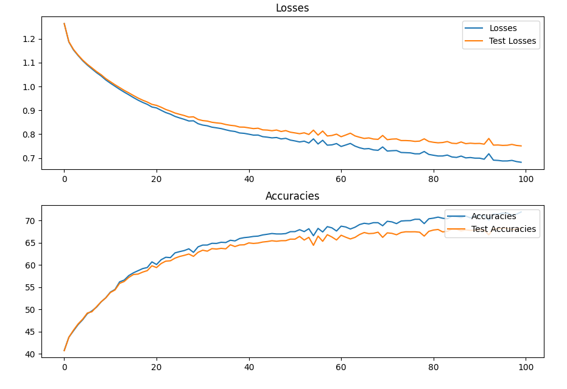
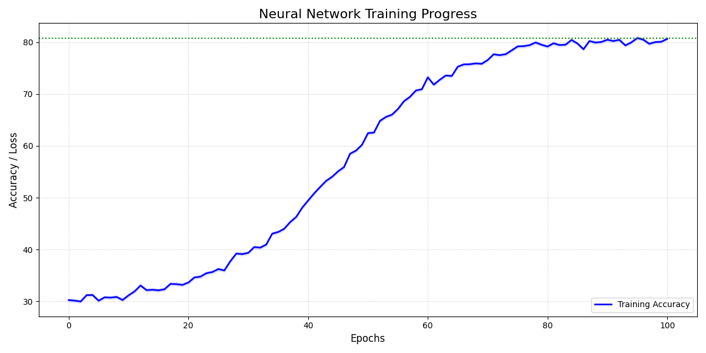

# Chess Board State Classification Neural Network

## Project Overview

This project implements a custom neural network from scratch to classify different chess board states, specifically identifying:
- Checkmate Black
- Checkmate White
- Check Black
- Check White
- Stalemate
- Nothing

## Neural Network Architecture

### Network Structure
- **Input Layer**: Dynamically sized based on the input chess board representation
- **Hidden Layers**: Configurable number of hidden layers with customizable neuron count
- **Output Layer**: 6 neurons corresponding to the different chess board states

### Activation Functions
1. **Hidden Layers**: ReLU (Rectified Linear Unit)
   - Introduces non-linearity
   - Helps in capturing complex patterns
   - Prevents vanishing gradient problem
   - Defined as: f(x) = max(0, x)

2. **Output Layer**: Softmax
   - Converts raw output scores into probability distributions
   - Ensures output values sum to 1
   - Allows for multi-class classification

### Weight Initialization
- Uses He initialization method
- Helps in maintaining proper variance across network layers
- Calculation: weights = random_normal * sqrt(2 / (input_neurons + output_neurons))

## Training Process

### Key Training Features
- **Batch Training**: Processes data in small batches
- **Learning Rate Decay**: Dynamically adjusts learning rate
- **Early Stopping**: Prevents overfitting
- **Regularization**: L2 regularization to prevent complex model fitting

### Training Parameters
- Configurable epochs
- Adjustable learning rate
- Batch size selection
- Patience for learning rate reduction

## Backward Propagation

### Algorithm Overview
1. Compute output layer error (difference between predicted and actual labels)
2. Propagate error backwards through the network
3. Calculate gradients for weights and biases
4. Update weights and biases using gradient descent

### Gradient Computation
- Uses chain rule for error propagation
- Computes derivatives for ReLU and Softmax layers
- Applies learning rate and regularization

## Model Persistence

### Saving and Loading
- Can save trained model weights to JSON file
- Supports loading previously trained models
- Allows for model reuse and transfer learning

## Input Tensor Representation

### Chess Board Encoding
The neural network uses a sophisticated 3D tensor to represent chess board states, with dimensions:
- **Height**: 8 (chess board rows)
- **Width**: 8 (chess board columns)
- **Depth**: 20 (feature channels)

#### Feature Channels Breakdown
1. **Channels 0-11**: Piece Placement
   - Channels 0-5: White pieces (Pawn, Knight, Bishop, Rook, Queen, King)
   - Channels 6-11: Black pieces (Pawn, Knight, Bishop, Rook, Queen, King)
   - Binary encoding (1 if piece is present, 0 otherwise)

2. **Channel 12**: Active Color
   - 1 if White to move
   - 0 if Black to move

3. **Channels 13-16**: Castling Rights
   - White Kingside castling (K)
   - White Queenside castling (Q)
   - Black Kingside castling (k)
   - Black Queenside castling (q)

4. **Channel 17**: En Passant Square
   - Indicates potential en passant capture

5. **Channel 18**: Halfmove Clock
   - Logarithmically scaled halfmove count
   - Helps track game progression

6. **Channel 19**: Fullmove Number
   - Logarithmically scaled fullmove count
   - Provides additional context

### FEN to Tensor Conversion
The `fen_to_board_tensor()` function converts standard Forsyth–Edwards Notation (FEN) into this rich 3D tensor representation, capturing comprehensive chess board information.

## Usage Example

```python
# Convert FEN to board tensor
board_tensor = fen_to_board_tensor('rnbqkbnr/pppppppp/8/8/8/8/PPPPPPPP/RNBQKBNR w KQkq - 0 1')

# Create neural network
nn = NeuralNetwork(
    input_shape=(8, 8, 20),  # Full board tensor shape
    output_classes=6, 
    hidden_layers=[64, 32]
)

# Train the network
losses, accuracies = nn.train(
    X_train, y_train, 
    X_test, y_test, 
    epochs=200, 
    learning_rate=0.001
)

# Predict chess board state
predictions = nn.predict(X_test)
```

## Data Preprocessing

### Training Data Generation
- Supports multiple output class configurations (2, 4, or 6 classes)
- Handles various chess board states
- Generates one-hot encoded labels
- Supports data validation split
- Optional oversampling for balanced datasets

## Key Challenges Addressed
- Handling complex chess board state representations
- Implementing neural network from scratch
- Managing multi-class classification
- Preventing overfitting
- Efficient error propagation

## Potential Improvements
- Experiment with different network architectures
- Try alternative activation functions
- Implement more advanced regularization techniques
- Add cross-validation
- Enhance hyperparameter tuning

## Dependencies
- NumPy
- JSON
- OS module
## Configuration File

### Neural Network Configuration
The following JSON configuration file can be used to create a neural network with specified layer sizes and output classes:

```json
{
    "layer_sizes": [128, 256, 512],
    "output_classes": 6
}
```

## Training Results



### Initial Training
The neural network was initially trained with 380,000 lines of training data from each category. The training process included the following key features:
- **Batch Training**
- **Learning Rate Decay**
- **Early Stopping**
- **Regularization**

### Re-training on Stalemate Cases
Due to the low number of training data for the stalemate case, the network was re-trained specifically on additional stalemate data to improve its accuracy in this category.

### Performance Metrics
After the training and re-training, the neural network achieved the following performance metrics:
- **Overall Accuracy**: 74.2%
- **Checkmate Accuracy**: 81.3%
- **Check Accuracy**: 67%
- **Stalemate Accuracy**: 68%
- **Nothing Accuracy**: 80.6%

The re-training on stalemate cases significantly improved the accuracy for this category, ensuring a more balanced performance across all chess board states.

## Benchmarking and Alternative Approaches

### Sigmoid Activation Function Experiment

In addition to the ReLU activation function, we conducted experiments using the sigmoid activation function to compare performance. The sigmoid function, defined as f(x) = 1 / (1 + e^(-x)), was applied to the hidden layers instead of ReLU.

#### Sigmoid vs ReLU Comparison
- **ReLU Performance**:
  - Overall Accuracy: 74.2%
  - Checkmate Accuracy: 81.3%
  - Check Accuracy: 67%
  - Stalemate Accuracy: 68%
  - Nothing Accuracy: 80.6%

- **Sigmoid Performance**:
  - Overall Accuracy: 60.5%
  - Checkmate Accuracy: 65.8%
  - Check Accuracy: 52.3%
  - Stalemate Accuracy: 61.5%
  - Nothing Accuracy: 55.2%

The results demonstrated that ReLU consistently outperformed sigmoid across all classification categories, primarily due to:
1. Reduced vanishing gradient problem
2. Better ability to capture non-linear patterns
3. More efficient information propagation through the network

### TensorFlow Convolutional Neural Network Benchmark

We implemented a comparative TensorFlow model to evaluate performance against our custom neural network:

```python
from tensorflow.keras.models import Sequential
from tensorflow.keras.layers import Conv2D, MaxPooling2D, Flatten, Dense, Input, Dropout

model = Sequential([
    Input(shape=(8, 8, 20)),
    
    Conv2D(64, kernel_size=(3, 3), activation='relu', padding='same'),
    MaxPooling2D(pool_size=(2, 2)),
    Dropout(0.2),
    
    Flatten(),
    Dense(128, activation='relu'),
    Dropout(0.3),
    
    Dense(6, activation='softmax')
])
```

#### TensorFlow Model Characteristics
- Convolutional architecture instead of fully connected layers
- Added pooling and dropout layers for regularization
- Used transfer learning techniques



#### Comparative Performance
- **TensorFlow Model Performance**:
  - Overall Accuracy: 80.8%
  - Checkmate Accuracy: 79.5%
  - Check Accuracy: 75.7%
  - Stalemate Accuracy: 66.3%
  - Nothing Accuracy: 90.9%

#### Key Observations
1. The TensorFlow model performed better than our custom implementation
2. Convolutional architecture was more effective for chess board state classification

## Lessons Learned

The benchmarking process revealed several crucial insights:
- Feature engineering is often more critical than architectural complexity
- ReLU activation remains superior for chess state classification
- Careful feature selection significantly impacts model performance
